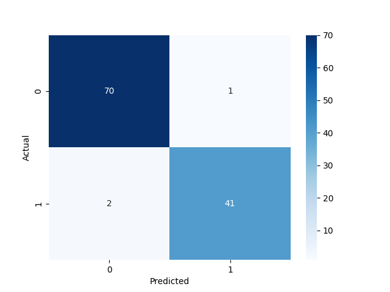
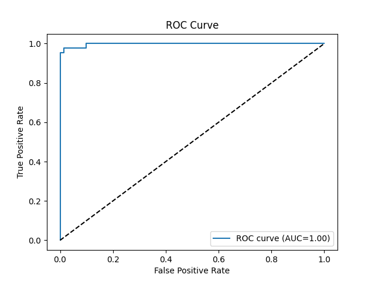

# Task 4: Logistic Regression Binary Classification

## Overview

This project demonstrates a complete **binary classification pipeline** using **Logistic Regression**. The pipeline includes **data loading**, **preprocessing**, **model training**, **evaluation**, and **threshold tuning** using precision-recall curves.

The project uses a Breast Cancer Wisconsin (Diagnostic) Data Set
---

## Folder Structure

```
Task4_LogisticRegression/
│
├── data/
│   └── data.csv                  
│
├── notebooks/
│   └── Logistic_Regression.ipynb 
│
├── src/
│   ├── data_loader.py            
│   ├── model.py                  
│   ├── evaluate.py               
│   └── utils.py                  
│
├── outputs/
│   ├── confusion_matrix.png      
│   ├── roc_curve.png             
│   └── classification_report.txt 
│
├── requirements.txt              
└── main.py                       
```

---

## Features

* Load and preprocess CSV or built-in dataset
* Handle missing values and scale features
* Train a **Logistic Regression** model
* Evaluate with:

  * Confusion Matrix
  * Classification Report (Precision, Recall, F1-score)
  * ROC-AUC Curve
* Tune decision thresholds using **Precision-Recall curve**
* Save trained model for future use

---

## Evaluation Visualizations

**Confusion Matrix:**



**ROC Curve:**



---

## Installation

1. **Clone the repository**

```bash
git clone https://github.com/Mamoonkhan11/LogisticRegression__AI-ML
cd LogisticRegression__AI-ML
```

2. **Create and activate a virtual environment**

```bash
python -m venv .venv
# Windows
.venv\Scripts\activate
# macOS/Linux
source .venv/bin/activate
```

3. **Install dependencies**

```bash
pip install -r requirements.txt
```

---

## Usage

1. **Run the main pipeline**

```bash
python main.py
```

2. **Customize dataset path**

```python
# In main file
X_train, X_test, y_train, y_test = Load_data(file_path="data/data.csv")
```

3. **Adjust threshold for classification**

```python
Evaluate_model(model, X_test, y_test, threshold=0.6)
```

4. **Optional: Jupyter Notebook**

```bash
jupyter notebook notebooks/Logistic_Regression.ipynb
```

---

## Dependencies

* Python >= 3.12
* pandas
* numpy
* scikit-learn
* matplotlib
* seaborn

*Install all dependencies via `pip install -r requirements.txt`.*

---

## Evaluation Metrics

* **Precision**: Correct positive predictions / Total predicted positives
* **Recall (Sensitivity)**: Correct positive predictions / Total actual positives
* **F1-score**: Harmonic mean of precision and recall
* **ROC-AUC**: Area under the ROC curve to measure classifier performance

---

## Notes

* Ensure your dataset is numeric or properly encoded before feeding it to the model.
* Missing or fully empty columns are automatically handled via imputation.
* Threshold tuning allows optimizing **precision vs recall** for specific use cases.

---
